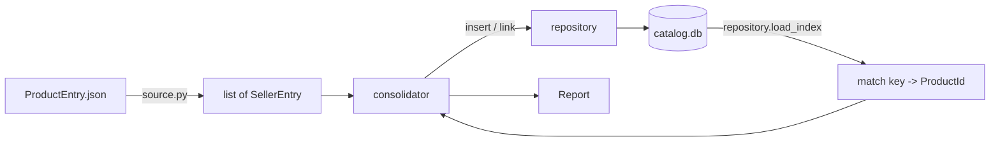

# Design

How the consolidation is built. *What* it does and *why* those semantics were chosen lives in [`DECISIONS.md`](DECISIONS.md); decision IDs `D1`–`D10` are referenced rather than restated. This document covers only design questions that `DECISIONS.md` deliberately leaves open.

## Scope

One command reads a JSON file of seller product submissions and consolidates it into an existing SQLite catalog: matching products that already exist, inserting those that do not, and recording which sellers offer each product.

Non-goals: no API, no concurrency beyond what a single transaction gives, no incremental or streaming ingest, no product data enrichment (`D2` forbids it). The assessment weights understanding over production readiness, so the design targets clarity and testability rather than throughput.

## Module layout

```
src/catalog_consolidation/
  __init__.py
  __main__.py        python -m catalog_consolidation
  cli.py             argument parsing, exit codes, report rendering
  models.py          SellerEntry, Product, MatchKey, Report - plain dataclasses
  normalize.py       the match key. Pure functions, no imports beyond stdlib
  source.py          JSON -> list[SellerEntry], per-record validation
  migration.py       schema migration, idempotent
  repository.py      every SQL statement in the project
  consolidator.py    orchestration; depends on abstractions, not sqlite3
tests/
```

The boundary that matters: **`repository.py` is the only module that imports `sqlite3`**, and `normalize.py` imports nothing. That makes the matching rule unit-testable without a database and the orchestration testable against a fake repository. `consolidator.py` holds the algorithm and knows nothing about SQL.

## Data flow



## Design decisions

### DS1 — The catalog index is preloaded into memory, and mutated during the run

One `SELECT Id, Name, Brand FROM Product` builds a `dict[MatchKey, int]`. Lookups are then O(1) with no per-record round trip.

At 975 products and 269 records the performance argument is negligible; the reason is correctness and testability. A single read means the matching logic is a pure function of a dictionary, so it can be tested without SQL, and the whole comparison happens against one consistent snapshot.

**The index is updated as products are inserted.** Without this, two incoming records for the same genuinely-new product would each miss the index and insert twice, producing a duplicate — the exact failure the assessment asks to prevent. The supplied file happens to contain each new product only once, so a test must construct this case deliberately rather than rely on the fixture.

Rejected: querying per record. It scales to a catalog that does not fit in memory, which this one does by three orders of magnitude, and it would put the matching rule behind SQL where it is harder to test.

Cost, stated plainly: memory grows with catalog size. A real system would either query per record against an indexed normalized column, or store the normalized key as a generated column so the database does the matching.

### DS2 — Migration is versioned via `user_version` and idempotent

`PRAGMA user_version` is 0 on the supplied file. The migration sets it to 1 and refuses to re-run when it already reads 1, so applying it twice is a no-op.

Two distinct operations, needing different mechanisms:

- **`SellerProductId` to `TEXT` (`D3`).** SQLite cannot alter a column's declared type, so this rebuilds the table: create `SellerProduct_new` with the corrected schema, copy all rows, drop the original, rename. The table is empty in the supplied file, but the copy step is written and tested so the migration is correct against a populated database.
- **The unique constraints (`D5`).** `CREATE UNIQUE INDEX` adds these in place with no rebuild.

Both run inside one transaction, so a failure leaves the original schema intact.

### DS3 — Duplicate suppression uses `ON CONFLICT DO NOTHING`, not `OR IGNORE`

Links are written with `INSERT INTO SellerProduct (...) VALUES (...) ON CONFLICT DO NOTHING`. `rowcount` is 1 when the row is written and 0 when a unique index rejects it, which yields the skipped-listing count with no read-before-write.

**`INSERT OR IGNORE` would be a bug here**, and the distinction is not cosmetic. `OR IGNORE` suppresses *every* constraint violation, not just uniqueness. Verified: a row with a null `SellerName` is silently discarded with `rowcount = 0`, which is indistinguishable from a duplicate skip. A malformed record would then be counted as a duplicate listing instead of reported as an error, quietly corrupting the report and defeating `D7`. `ON CONFLICT DO NOTHING` raises `IntegrityError: NOT NULL constraint failed` on the same input, so the record is reportable.

Neither form catches a foreign-key violation, which is handled by `DS8`.

This is why `D5` puts idempotency in the schema rather than in application logic. A `SELECT` then `INSERT` would be two statements racing each other and would need the count tracked separately.

### DS8 — Connection setup: pragmas before any statement, explicit transactions

Two SQLite behaviours make this non-obvious, both verified.

**`PRAGMA foreign_keys` is silently ignored inside a transaction.** Python's `sqlite3` opens an implicit transaction on the first data-modifying statement under its default `isolation_level`, so a pragma issued after any write is a no-op that reports success. A foreign-key violation then inserts happily. The repository therefore sets `PRAGMA foreign_keys = ON` as the first statement on a fresh connection and asserts it reads back as 1.

**Transaction boundaries are managed explicitly.** The connection is opened with `isolation_level=None`, so `BEGIN`, `COMMIT`, and `ROLLBACK` are issued in code rather than inferred. `D8` requires one transaction spanning the whole run, and implicit transaction handling would otherwise commit at points the design does not choose.

Verified that the pragma survives a rollback, so enforcement is not lost when a run aborts.

### DS4 — No default database path

`--database` is required. There is no default, so no invocation can silently mutate `data/catalog.db`, the pristine baseline committed per the README.

The intended workflow copies the baseline to an ignored working file:

```
copy data\catalog.db data\catalog.local.db
python -m catalog_consolidation --database data/catalog.local.db --input data/ProductEntry.json
```

`data/*.local.db` is already in `.gitignore`.

### DS5 — CLI surface

```
python -m catalog_consolidation --database PATH --input PATH [--dry-run] [--report {text,json}]
```

- `--dry-run` wraps **both the migration and the consolidation** in a single transaction and rolls it back, printing the report it would have produced. Including the migration is required for the run to be meaningful, since consolidation depends on the widened column and the unique indexes from `D3` and `D5`. It is also required for the run to be honest: committing the migration and rolling back only the inserts would mutate the file during an operation named dry run.

  This works because SQLite makes DDL transactional. Verified against a copy of the supplied catalog: a table rebuild, two `CREATE UNIQUE INDEX` statements, a `PRAGMA user_version` bump, and a product insert all roll back together, leaving the declared column type, the index list, the row count, `user_version`, and the file bytes exactly as they were.
- `--report json` emits the report as JSON for assertion in tests and by machines.
- Exit code 0 on success, 1 when any record failed, 2 on a usage or I/O error. A run that skips duplicates is a success, not a failure — skipping is the specified behaviour.

### DS6 — The report is a value object, not print statements

`consolidator.consolidate(...)` returns a `Report` dataclass; `cli.py` renders it. The orchestration prints nothing, which is what lets the integration test assert on the acceptance numbers directly rather than parsing stdout.

```
records read              269
matched existing product   266
products inserted            3
links created              257
duplicate listings skipped  12
records failed               0
```

### DS7 — Per-record errors are collected, not raised

Per `D7`, a malformed record is recorded in `Report.errors` with its index and reason, and the run continues. This sits inside `D8`'s single transaction: the batch still commits atomically, and errored records simply contribute nothing.

Deliberate consequence: a file where every record fails commits successfully with zero rows written and exit code 1. That is correct — nothing was wrong with the transaction, only with the data.

## Test strategy

The acceptance numbers in `DECISIONS.md` are the primary test, and they are known before the code exists, so they can be written first.

| Test | Asserts |
| --- | --- |
| `test_normalize` | table-driven over the real variations: doubled spaces, `Câmera`/`Camera`, `Levi's`/`Levis`, `34"`/`34`, `12.9"`/`12.9''`, `None` brand (`D1`) |
| `test_normalize_is_lossless` | the key yields 975 distinct values over the supplied catalog, so no two products merge (`D1`) |
| `test_migration_idempotent` | applying twice is a no-op; `user_version` reaches 1; rows survive a rebuild on a populated table (`DS2`) |
| `test_new_product_deduped_within_run` | two records for the same absent product insert one row, not two (`DS1`) |
| `test_id_not_unique_across_sellers` | one `Id` shared by two sellers on different products yields two products and two links (`D4`) |
| `test_consolidate_acceptance` | full run on a copy of the supplied catalog reproduces 269/266/3/978/257/12 exactly |
| `test_idempotent_second_run` | rerunning the same file adds zero rows to either table (`D5`) |
| `test_injection_record_stored_literally` | the `TestBrand'; SELECT 1; --` brand round-trips as an exact string and the schema is unchanged (`D7`) |
| `test_existing_products_untouched` | every pre-existing `Product` row is byte-identical after a full run, including the 119 null brands and the `Photo`/`Photography` disagreement (`D2`) |
| `test_failure_rolls_back` | an error injected mid-run leaves the database with zero new rows in either table (`D8`) |
| `test_malformed_record_is_reported_not_skipped` | a record that violates `NOT NULL` appears in `Report.errors` and is *not* counted as a duplicate listing (`DS3`) |
| `test_dry_run_mutates_nothing` | file hash is identical after `--dry-run`, including when the migration has not yet been applied (`DS5`) |

Integration tests copy `data/catalog.db` to a temporary path per test. The committed baseline is never opened for writing.

Standard library `unittest` is sufficient and keeps the core path dependency-free, consistent with the conventions in the README.
